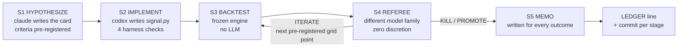

# quantlab

An autonomous multi-agent research lab that generates crypto trading
hypotheses, implements them, backtests them against a frozen engine, and
kills them against criteria registered before any data is touched. **The
product is idea-killing discipline, not alpha; the expected steady state
is that nearly everything dies.** If this repo ever leads with an equity
curve, something has gone wrong with it.

<!-- LEDGER_STATS:BEGIN (generated by scripts/ledger_stats.py — do not edit by hand) -->
| statistic | count |
|---|---|
| hypotheses tested | 1 |
| killed on merits | 1 |
| killed on infrastructure | 0 |
| exhausted their iteration budget before dying | 1 |
| promoted | 0 |
| single-shot holdout runs (human-only) | 0 |
| infrastructure-kill rate | 0.0% |

*Computed from [LEDGER.md](LEDGER.md) by [scripts/ledger_stats.py](scripts/ledger_stats.py) on 2026-07-12 02:30 UTC — the table regenerates from the ledger and cannot drift from it.*
<!-- LEDGER_STATS:END -->

## The problem this design exists to solve

An agent that writes a strategy, backtests it, and grades the result is an
agent grading its own homework — and in backtesting, *every bug is fake
alpha*. An off-by-one in a date index reads tomorrow's close; a survivor-
biased universe buys winners retroactively; a signal that quietly loads
the full dataset defeats any truncation the harness applies. None of these
feel like bugs from the inside: they feel like discoveries, they produce
beautiful Sharpe ratios, and a self-graded loop will happily promote them
all night. The failure mode of naive "AI quant" systems is not that they
find nothing — it is that they find far too much.

The second failure needs no bugs at all. Test enough hypotheses against
the same three years of data and some will clear any fixed bar by chance;
run an LLM idea generator overnight and you have industrialized multiple
testing. Honest code plus enough attempts still manufactures false
discoveries. That is why the bar here *rises with the attempt count*
(deflated Sharpe over the running ledger), why kill thresholds are frozen
before results exist, and why the final check is a single-shot holdout
the loop physically cannot see.

## Architecture: five trust mechanisms

Components appear inside the defenses they serve, not the other way
around.

**1. The frozen zone.** Evaluation code and evaluated code never share a
writer. `engine/` (loader, portfolio construction, cost model, walk-
forward, metrics) is built during setup, protected by review gates, and
mounted **read-only** in the overnight container; `hypotheses/H###/` is
the only place the loop writes code. An agent cannot relax the grader it
is being graded by — the two-zone split is enforced by the mount table,
not by instructions.

**2. Pre-registration, timestamped in git.** Every hypothesis card
declares machine-parsed kill criteria and a bounded iteration grid (max 2
extra parameter points, listed at birth or never) *before* the backtest
runs, and the commit ordering proves it: for H001, the card with its
criteria is committed in
[`112c42c` (H001/S1: hypothesize)](https://github.com/ZelinZhu-Richard/auto-quant-research-lab/commit/112c42c)
and the first results only exist as of
[`7528fb9` (H001/S3: backtest)](https://github.com/ZelinZhu-Richard/auto-quant-research-lab/commit/7528fb9).
Moving a goalpost after seeing results would require rewriting public git
history.

**3. Independence of the referee.** The stage that judges results runs on
a **different model family** than the stage that invented the idea
(Anthropic writes, OpenAI referees), under a zero-discretion decision
rule: parse the pre-registered blocks, compare against results.json,
apply SPEC §8 mechanically, emit a schema-validated decision that cites
every number. The referee never proposes fixes — two referees given the
same inputs must reach the same decision, and the orchestrator rejects
any output that deviates from the schema or the declared grid.

**4. Deflated Sharpe: the bar rises with the attempt count.** Idea #40
faces a harder promotion bar than idea #3. The engine computes the
deflated Sharpe ratio (Bailey & López de Prado) using the trial count and
trial-Sharpe variance read from the append-only ledger at referee time,
so industrialized multiple testing is priced into every decision rather
than discovered in a postmortem.

**5. Single-shot, physically absent holdout.** Data after 2025-07-01
lives outside the repository entirely; the container's mount table binds
only `data/train_val` (an in-container acceptance test asserts the data
directory contains *exactly* train_val plus two audit JSONs). A PROMOTE
earns one holdout run, executed by a human, once per idea, ever — and the
memo documents the outcome whether or not the idea survives. A documented
holdout failure is a success of the process.

### The five-stage cycle



Any mid-cycle failure becomes `KILLED(infrastructure)` — logged
distinctly from merit kills so the infrastructure failure rate is itself
a tracked metric — and the loop continues (one repair attempt on red
tests, never a retry spiral).

## Anatomy of one hypothesis: H001

H001 is a good specimen precisely because it exhausted its entire
pre-registered budget before dying. Real excerpts:

**The card** (S1, claude) named who is on the other side of the trade:

> Crypto markets underreact to sustained price trends … because the
> marginal participant is retail, and retail flow exhibits the
> disposition effect: holders sell winners too early … and cling to
> losers hoping to break even. … the behavior is a psychological bias,
> not an information advantage — it does not learn from losses at the
> population level.

**The pre-registration block** — frozen at commit `112c42c`, before any
backtest existed:

```json
{"min_sharpe": 1.0, "max_drawdown": 0.30, "min_hit_rate": 0.50,
 "min_sign_consistent_folds": 3}
```
```json
[{"lookback_days": 60, "skip_days": 7}, {"lookback_days": 120, "skip_days": 7}]
```

**The results** (S3, frozen engine, 973 return days, 25 bps/side): the
90-day variant lost money after costs; the referee spent both
pre-registered iterations (60d, then 120d) exactly in declared order —
the orchestrator patches one `PARAMS` line per iteration, no LLM
involved. Final iteration: annualized Sharpe **−0.86**, max drawdown
**46.8%**, hit rate **49.0%**, turnover 64×/year, deflated Sharpe
**0.078** at trial count N=1.

**The decision** (S4, codex) cites every number against every threshold:

> "The pre-registered minimum Sharpe of 1.0 failed with an observed
> annualized Sharpe of −0.8645…; the pre-registered maximum drawdown of
> 0.30 failed with 0.4680…; and the pre-registered minimum hit rate of
> 0.50 failed with 0.4902…. The pre-registered stability requirement …
> passed at 3/4, while the required deflated Sharpe of 0.95 failed with
> 0.0781…. Because not all criteria passed and this is iteration 2, the
> mechanical decision is KILL on merits."

**The memo** ([hypotheses/H001/memo.md](hypotheses/H001/memo.md)) closes
the loop with method, per-fold numbers (−0.74, +0.63, −1.41, −1.76), and
lineage: the git commit of the code that produced the results and the
sha256 manifest of the exact data files used.

## Safety and change control

The overnight loop runs in a container on an internal-only network whose
sole egress is a proxy allowlisting exactly two verified LLM API domains
(`api.anthropic.com`, `chatgpt.com` — nothing unverified is pre-added);
`engine/` and the data are mounted read-only; dependencies and CLIs are
baked at build time so there is no package-registry egress at runtime; no
credentials exist in any committed artifact — the human injects capped
API keys at launch. The container commits locally and cannot push;
morning review and the push are human rituals.

Structural change control is the rarer part. Any diff touching
`orchestrator/`, `engine/`, Docker files, or dependency pins requires a
**Codex review gate** before it proceeds (procedure codified in
[SETUP_NOTES.md](SETUP_NOTES.md)). The gates are not ceremony — they have
caught, among other things: a blanket data mount that would have exposed
**holdout-period bars inside the container** via `data/all`; fail-open
git steps in the run-finalization path; an I/O purity guard that took
seven adversarial rounds to harden (culminating in kernel-level
`RLIMIT_NOFILE=0` around all signal execution); and a self-grading
loophole where the referee could misreport its own identity. Every stage
of every cycle is a separate git commit — the audit spine is the history
itself. And after a vendor update silently rotated the CLI's default
model, **model identity moved into the repo under gate review**: S2 and
S4 models are pinned constants passed explicitly on every invocation,
recorded per run in `summary.json`, and enforced by the decision
validator (the shakedown referee had self-reported a vague "codex gpt-5";
that can no longer happen).

## Stated limitations

- **Venue-level survivorship residue.** The candidate pool is coins
  tradable on Coinbase Exchange *today*; coins delisted before the
  universe was built are absent. Universe selection is otherwise
  point-in-time (ranked by median dollar volume in the first 90 days of
  the sample), but the venue itself already survived.
- **Single-venue volume.** Liquidity ranks come from one exchange;
  cross-exchange volume is not considered.
- **Daily bars only.** Nothing intraday; execution is modeled at daily
  closes with a one-day lag.
- **Flat 25 bps/side cost model.** No market impact, no spread dynamics,
  no size dependence. High-turnover signals die partly by construction —
  which is a choice, not physics.
- **Three-year train window.** 2022-07 to 2025-06 spans few regime
  cycles; fold stability across four sub-periods is a weak proxy for
  regime robustness.
- **LLM hypothesis space.** The idea generator is biased toward the
  factor literature it trained on. Expect momentum, reversal, volatility,
  and volume stories — not genuinely novel structure. The pipeline's
  value is killing them honestly, not the originality of what it tries.

## Reproduce it

```bash
git clone https://github.com/ZelinZhu-Richard/auto-quant-research-lab.git
cd auto-quant-research-lab
uv sync

# Data: ~10 min, Coinbase Exchange public API, no keys required.
# Fetch goes through the committed wrapper (not data_pipeline.py's
# download-all directly): upstream pagination dies on actively-trading
# symbols when the request window crosses "now" — the wrapper is the
# canonical fix, documented in BACKLOG.md.
uv run python scripts/fetch_train_val_data.py 2022-07-01
uv run python data_pipeline.py universe --start 2022-07-01
uv run python data_pipeline.py split    --cutoff 2025-07-01
mv data/holdout ~/quantlab_holdout_DO_NOT_MOUNT   # R2: physically absent

# 5-minute demo, no LLM keys: 55 tests, then two full mocked-LLM cycles
# against the real engine and real data — ledger lines, memos, and
# per-stage commits included.
uv run pytest tests/
uv run python -m orchestrator.loop --mode dry-run --max-cycles 2 --run-id demo
git add runs/ STATE.md && git commit -m "run demo: toolcall log finalized" -- runs/ STATE.md

# One real cycle, live CLIs in the foreground (requires claude + codex
# installed and authenticated):
bash scripts/shakedown.sh
```

The container path (`docker compose run --rm dryrun`) additionally proves
the mount and egress posture: it asserts `engine/` is unwritable,
`data/` contains exactly train_val plus the audit JSONs, and pypi.org is
unreachable, then runs the same two cycles inside the sandbox.

## What this is not

Not investment advice. Not a live-capital or execution system — nothing
here places orders. Not a claim of discovered alpha: every result above
is a kill, and that is the demonstrated capability — the process, not a
signal.

## Stack and provenance

Python 3.12 · pandas 3.0 · pyarrow · ccxt · uv · pytest · Docker +
tinyproxy egress allowlist · plain-Python orchestrator (no agent
framework) · headless `claude` and `codex` CLIs.

Models per stage (pinned in `orchestrator/stages.py`, audited per run in
`runs/<id>/summary.json`): S1/S5 hypothesis and memo — Claude (CLI
default, identity recorded each run); S2 implementation — `gpt-5.6-sol`
at `xhigh` effort; S4 referee — `gpt-5.6-terra`, deliberately not the
strongest model available: **the referee needs obedience, not
capability**.

This repository was built by Claude Code, with OpenAI Codex as the
structural reviewer, under the gate protocol documented in
[SETUP_NOTES.md](SETUP_NOTES.md) — every R5-path diff review-gated, every
finding and resolution in the commit history. For this audience that is
the point, not a confession.
